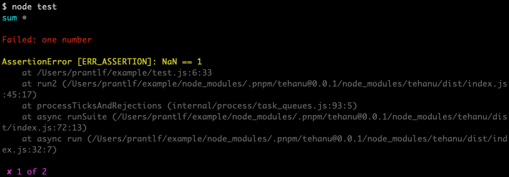

# Colourful Console Test Reporter

[](http://badge.fury.io/js/tehanu-repo-coco)

Reports the test progress of tests written with [tehanu] on the console with colours if the terminal supports them.

## Synopsis



test.js:

```js
const test = require('tehanu')('sum'),
      { equal } = require('assert'),
      sum = require('./sum')

test('two numbers', () => equal(sum(1, 2), 3))
test('one number', () => equal(sum(1), 1))
```

## Installation

You can install the test reporter using your favourite Node.js package manager:

```
npm i -D tehanu-repo-coco
yarn add -D tehanu-repo-coco
pnpm i -D tehanu-repo-coco
```

## Configuration

If the environment variable `NO_COLOR` is not empty, colouring the output will be disabled. If the environment variable `FORCE_COLOR` is not empty, colouring the output will be enabled, although the terminal support for colours will not be detected.

[tehanu]: https://www.npmjs.com/package/tehanu
