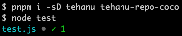

# Test Harness Core

[](http://badge.fury.io/js/tehanu)

Provides a [framework] for creation and execution of test suites.

## Synopsis



test.cjs:

```js
const test = require('tehanu')(__filename)

test('dummy', () => {})
```

test.mjs:

```js
import tehanu from 'tehanu'

const test = tehanu('sum')

test('dummy', () => {})
```

test.mjs (unnamed suite):

```js
import test from 'tehanu/suite'

test('dummy', () => {})
```

## Installation

You can install the test harness using your favourite Node.js package manager:

```
npm i -D tehanu
yarn add -D tehanu
pnpm i -D tehanu
```

## Test Suite

The default export of the `tehanu` module:

```js
const tehanu = require('tehanu')
```

is a test suite factory function:

```ts
tehanu(name: string): (...) => void
```

If the `name` of the suite is an absolute path and it starts with the current process path (`process.cwd()`), usually supplied as `__filename`, the leading current process path will be trimmed and only the relative path to the current process path will be used. If you want to trim all the path and leave just the file name, you can use the expression `require('path').basename(__filename)` instead of just `__filename`. The same will work with `import.meta.url` in ES modules.

Calling test suite factory function will create a new test suite:

```js
const test = tehanu(__filename)
```

and return a test factory function:

```ts
test(name: string, fn: () => void | Promise): void
```

Calling the test factory function will add another test to the test suite:

```js
test('one number', () => ...)
```

A test suite is usually alone in a single test file:

```js
const test = require('tehanu')(__filename)

test('one number', () => ...)
```

But a single test file may include more test suites:

```js
const tehanu = require('tehanu')
const test1 = tehanu('add')
const test2 = tehanu('remove')

test1('add one', () => ...)
test2('remove one', () => ...)
```

Multiple source files with test suites can be executed either by [`teru` - the test runner](#../teru#readme), or by creating a test suite index, which can be executed by `node`:

```js
require('./sum1.test')
require('./sum2.test')
```

ESM modules are supported too:

```js
import tehanu from 'tehanu'

const test = tehanu(import.meta.url)

test('one number', () => ...)
```

with a shortcut to an unnamed test suite creation:

```js
import test from 'tehanu/suite'

test('one number', () => ...)
```

## Setup and Tear Down

The test factory function carries properties exposing methods for adding callbacks to execute before and after the tests:

```ts
// Adds callbacks to execute before and after all tests in a test suite
before(fn: () => void | Promise): void
after(fn: () => void | Promise): void
// Adds callbacks to execute before and after each test in a test suite
beforeEach(fn: () => void | Promise): void
beforeEach(fn: () => void | Promise): void
```

The callbacks can be registered anywhere in the source file and will be executed in the declared order:

```js
const test = require('tehanu')(__filename)

test.before(() => ...)
test('one number', () => ...)
```

## Limiting and Skipping Tests

The test factory function carries properties exposing methods for limiting the test execution only to selected tests and to skip selected tests:

```ts
// Adds the test to a limited set of tests to execute
only(name: string, fn?: () => void | Promise): void
// Removes the test from the set of tests to execute
skip(name: string, fn: () => void | Promise): void
```

The `.only` suffix can be temporarily inserted to the test sources to limit the test execution only to a few tests to make debugging easier. The `.skip` suffix can be temporarily inserted to the test sources to exclude the execution of some tests until they are fixed:

```js
const test = require('tehanu')(__filename)

test.only('one number', () => ...)
test.skip('two numbers', () => ...)
```

## Test Execution

Tests are executed automatically once all tests suites get loaded. It is ensured by starting the execution from a `setImmediate` callback. All tests and test suites have to be declared synchronously in test sources.

If you want to suppress the automatic test execution, set the `autostart` property in `package.json` to `false`:

```json
"tehanu": {
  "autostart": false
}
```

If your tests run in the browser, set the `autostart` property on the global `tehanu` object to `false`:

```js
(window.tehanu || (window.tehanu = {}).autostart = false
```

The loaded tests can be executed manually using either the `schedule` or the `run` method:

```ts
const { schedule, run } = require('tehanu')

interface Options {
  reporter?: Reporter,
  bail?: boolean,
  parallel?: boolean,
  parallelSuites?: boolean
}

schedule(options?: Options): void
run(options?: Options): Promise
```

The method `schedule` ensures that the test suites are processed just once, even if it is called multiple times. It also reads the default options from the `tehanu` object in `package.json`, or in the browser. It also works well together with [teru]. The method `run` executes the test suites right away and is not compatible with [teru].

The `tehanu` object in `package.json`, or in the browser, or the options for the `schedule` and `run` methods can contain the following additional properties to control the test run:

* `bail`: if set to `true`, the test execution will be aborter after the first failure occurs.
* `parallel`: if set to `true`, the test suites will be executed concurrently.
* `parallelSuites`: if set to `true`, the tests within one test suite will be executed concurrently.

If a test fails, the exit code of the process running the tests will be set to `1`.

## Reporters

No reporter is used by default, which means that only errors thrown from the failed tests will be printed on the console. A reporter can print more information about the test progress and can be provided by a couple of ways.

### Declarative

If you install one or multiple reporters as dependencies, the first one will be chosen automatically:

```json
"devDependencies": {
  "tehanu": "1.0.0",
  "tehanu-repo-coco": "1.0.0"
}
```

If you install multiple reporters, you can choose one of them explicitly:

```json
"tehanu": {
  "reporter": "tehanu-repo-tape"
},
"devDependencies": {
  "tehanu": "1.0.0",
  "tehanu-repo-coco": "1.0.0",
  "tehanu-repo-tape": "1.0.0"
}
```

If you run the tests in the browser, you can supply the reporter by the global `tehanu` object:

```html
<script src=node_modules/tehanu/dist/index.min.js></script>
<script src=node_modules/tehanu-repo-tape/dist/index.min.js></script>
<script src=test/index.js></script>
<script>
  (window.tehanu || (window.tehanu = {}).reporter = tehanuTape
</script>
```

```html
<script type=module>
  import tape from 'node_modules/tehanu-repo-tape/dist/index.min.mjs'
  import 'test/dist/index.js'

  (window.tehanu || (window.tehanu = {}).reporter = tape
</script>
```

But you do not have to do it with `tape`, because this reporter registers to the `tehanu` object automatically for convenience:

```html
<script src=node_modules/tehanu/dist/index.min.js></script>
<script src=node_modules/tehanu-repo-tape/dist/index.min.js></script>
<script src=test/index.js></script>
```

```html
<script type=module>
  import 'node_modules/tehanu-repo-tape/dist/index.min.mjs'
  import 'test/dist/index.js'
</script>
```

### Programmatic

If you execute the functions `schedule` or `run` yourself, you can pass a `reporter` object to them:

```ts
const { factory, schedule } = require('tehanu')
const test = factory('sum')

test('dummy', () => {})

const reporter = {
  start() {},
  startSuite() {},
  ok({ name }) { console.info(`DONE: ${name} `) },
  fail({ name }, { stack }) {
    console.error(`FAIL: ${name}

${stack}`)
  },
  bail() {},
  skip() {},
  endSuite() {},
  end() {}
}

schedule({ reporter })
```

A reporter has to implement the `Reporter` interface:

```ts
export interface Test {
  readonly name: string
  readonly fn?: () => void | Promise
}

interface Reporter {
  start(): void
  startSuite(name: string, tests: Test[]): void
  ok(test: Test): void
  fail(test: Test, err: Error): void
  bail(): void
  skip(test: Test): void
  endSuite(): void
  end(): void
}
```

[framework]: https://github.com/prantlf/tehanu#readme
[teru]: ../teru#readme
