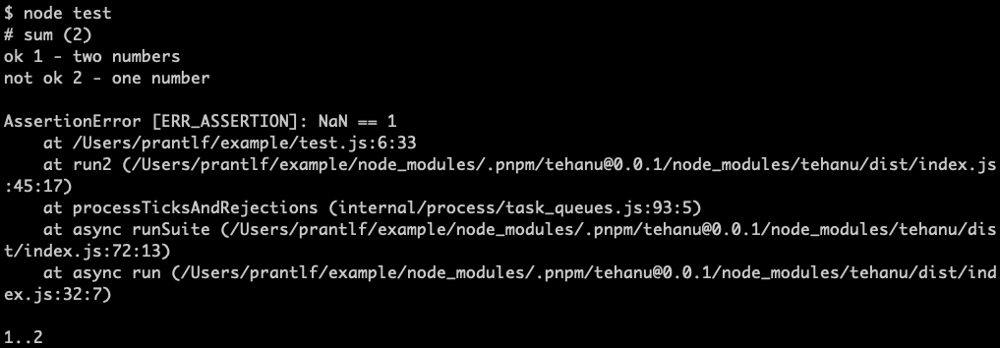

# TAP Test Reporter

[](http://badge.fury.io/js/tehanu-repo-tape)

Reports the test progress of tests written with [tehanu] on the console using the [TAP] protocol format.

## Synopsis



test.js:

```js
const test = require('tehanu')('sum'),
      assert = require('assert'),
      sum = require('./sum')

test('two numbers', () => assert.equal(sum(1, 2), 3))
test('one number', () => assert.equal(sum(1), 1))
```

## Installation

You can install the test reporter using your favourite Node.js package manager:

```
npm i -D tehanu-repo-tape
yarn add -D tehanu-repo-tape
pnpm i -D tehanu-repo-tape
```

[tehanu]: https://www.npmjs.com/package/tehanu
[TAP]: https://node-tap.org/tap-protocol/
