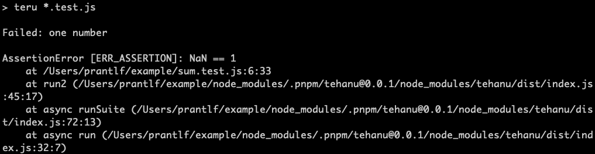

# Test Runner

[](http://badge.fury.io/js/tehanu-teru)

Runs test suites written with [tehanu] in multiple source files.

## Synopsis



sum1.test.js:

```js
const test = require('tehanu')('sum1'),
      assert = require('assert'),
      sum = require('./sum')

test('one number', () => assert.equal(sum(1), 1))
```

sum2.test.js:

```js
const test = require('tehanu')('sum2'),
      assert = require('assert'),
      sum = require('./sum')

test('two numbers', () => assert.equal(sum(1, 2), 3))
```

Running `teru *.test.js` or `teru sum1.test.js sum2.test.js` allows executing some or all test suites.

## Installation

You can install the test runner using your favourite Node.js package manager:

```
npm i -D tehanu-teru
yarn add -D tehanu-teru
pnpm i -D tehanu-teru
```

## Usage

Run tests written with Tehanu:

    teru [option ...] [pattern ...]

### Options

    -r|--reporter <name>       choose a reporter (coco, tape or custom)
    -R|--require <module>      preload a Node.js module to the process
    -b|--[no-]bail             abort after the first failure occurs
    -p|--[no-]parallel         execute test suites concurrently
    -s|--[no-]parallel-suites  execute tests in a suite concurrently
    -V|--version               print version number
    -h|--help                  print usage instructions

If no pattern is provided, `./**/*.js` will be used by default. If no reporter is provided, just errors will be printed on the console.

### Examples

    teru -b
    teru -r tape test/*.js

## Alternative

The alternative to the `teru` test runner is creating a test suite index and executing it by `node tests`:

tests.js:

```js
require('./sum1.test')
require('./sum2.test')
```

[tehanu]: https://www.npmjs.com/package/tehanu
